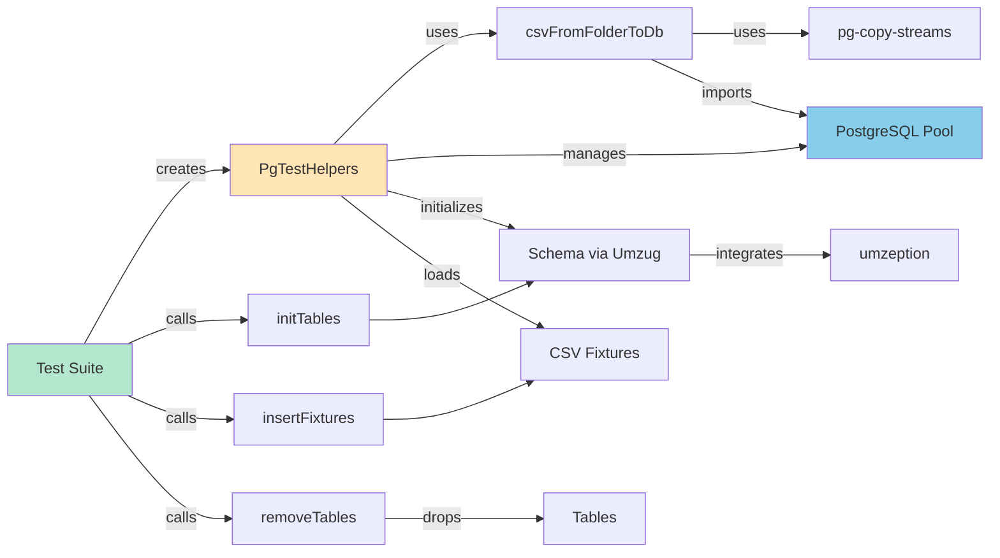
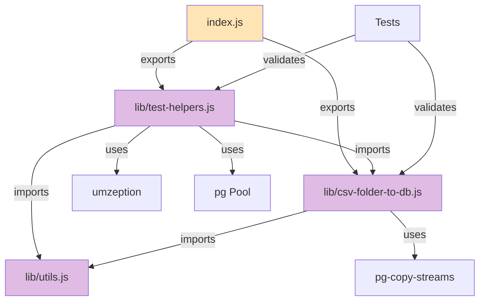
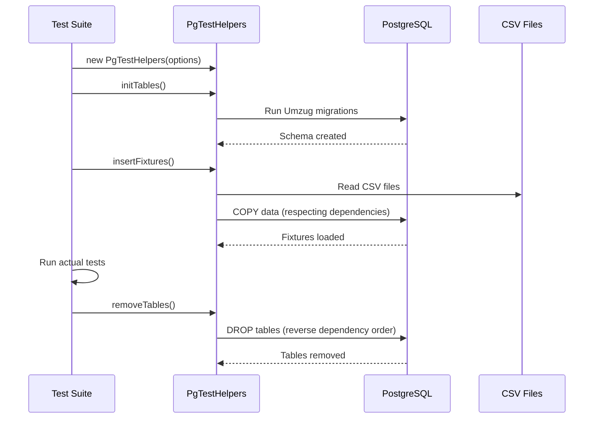
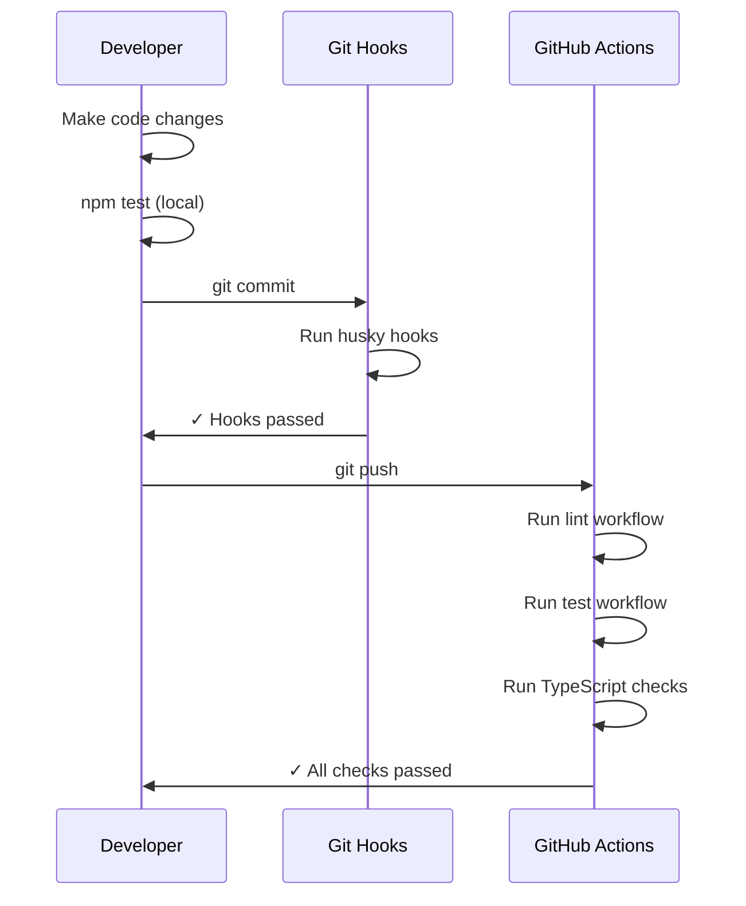

# GitHub Copilot Instructions for @voxpelli/pg-utils

## Overview

This repository provides **PostgreSQL database utilities and test helpers** for Node.js applications. It's designed to simplify database testing by managing schema initialization, fixture loading, and table cleanup in test environments.

### What This Package Does

`@voxpelli/pg-utils` helps you:
- **Set up test databases** with schema and fixtures quickly
- **Import CSV data** into PostgreSQL tables efficiently using PostgreSQL COPY
- **Manage test lifecycles** with easy table creation and cleanup
- **Handle table dependencies** when loading fixtures or dropping tables

### When to Use This Package

Use `@voxpelli/pg-utils` when:
- **Writing tests** for applications that use PostgreSQL
- **Loading test fixtures** from CSV files into test databases
- **Managing database schemas** with Umzug migrations in tests
- **Need repeatable test setups** with clean database state

### Project Architecture



### Component Relationships



### Test Workflow with Fixtures



### Development Workflow



---

## Coding Guidelines for GitHub Copilot

### Code Style and Standards

1. **JavaScript Style**
   - Use ESM (ECMAScript Modules) syntax exclusively (`import`/`export`)
   - Follow [neostandard](https://github.com/neostandard/neostandard) JavaScript style guide
   - Use single quotes for strings
   - Include semicolons
   - 2-space indentation

2. **Type Safety**
   - Use TypeScript for type definitions but write JavaScript for implementation
   - Include JSDoc comments with type annotations
   - Maintain strict type coverage (>95%)
   - Generate `.d.ts` files from JSDoc annotations
   - Example:
     ```javascript
     /**
      * @param {string | URL} path - The path to the CSV folder
      * @param {Pool} pool - PostgreSQL connection pool
      * @param {string[]} [tablesWithDependencies] - Tables with dependencies
      * @returns {Promise<void>}
      */
     export async function csvFromFolderToDb(pool, path, tablesWithDependencies) {
       // implementation
     }
     ```

3. **Module Structure**
   - Main entry point: `index.js` (exports from lib)
   - Implementation: `lib/*.js` files
   - Type definitions: Auto-generated from JSDoc
   - Keep index.js minimal - just re-exports

4. **File Organization**
   ```
   /index.js                    # Main entry, re-exports from lib
   /index.d.ts                  # Generated type definitions
   /lib/test-helpers.js         # PgTestHelpers class
   /lib/csv-folder-to-db.js     # CSV import utilities
   /lib/utils.js                # Shared utilities
   /test/*.spec.js              # Mocha test files
   ```

### PostgreSQL-Specific Patterns

1. **Database Connection Management**
   - Always use connection pools (pg.Pool) for connections
   - Accept both connection strings and Pool instances where appropriate
   - Clean up pools properly with `pool.end()`
   - Example:
     ```javascript
     // In utils.js pattern
     export function createPgPool(connectionString) {
       return new Pool({ connectionString });
     }
     ```

2. **CSV Import with pg-copy-streams**
   - Use PostgreSQL COPY command for efficient bulk imports
   - Use `pg-copy-streams` for streaming CSV data
   - Handle table dependencies when importing fixtures
   - Example pattern:
     ```javascript
     import { from as copyFrom } from 'pg-copy-streams';
     
     const stream = client.query(copyFrom(`COPY "${table}" FROM STDIN CSV HEADER`));
     await promisedPipeline(createReadStream(file), stream);
     ```

3. **Table Dependency Management**
   - Support both flat arrays and nested arrays for dependencies
   - Insert fixtures for dependent tables last
   - Drop dependent tables first when cleaning up
   - Flat array: `['table1', 'table2']` - table2 depends on table1
   - Nested array: `[['table1', 'table2'], 'table3']` - table3 depends on both table1 and table2

4. **Schema Management with Umzug**
   - Support Umzug instances for migrations
   - Support raw SQL schema files as URLs or strings
   - Use `umzeption` for PostgreSQL-specific Umzug context
   - Example:
     ```javascript
     if (typeof schema === 'function') {
       const umzug = schema(this.#pool);
       await umzug.up();
     } else {
       const schemaString = await readFile(schema, 'utf8');
       await pgInstallSchemaFromString(context, schemaString);
     }
     ```

### Testing

1. **Test Framework**
   - Use Mocha for test runner
   - Use Chai for assertions
   - Use chai-as-promised for async assertions
   - Place tests in `test/` directory with `.spec.js` extension
   - Example:
     ```javascript
     import { describe, it } from 'mocha';
     import chai from 'chai';
     import chaiAsPromised from 'chai-as-promised';
     
     chai.use(chaiAsPromised);
     const { expect } = chai;
     
     describe('PgTestHelpers', () => {
       it('should initialize tables', async () => {
         const helpers = new PgTestHelpers({
           connectionString: process.env.DATABASE_URL,
           schema: new URL('./fixtures/schema.sql', import.meta.url)
         });
         await helpers.initTables();
         // assertions
       });
     });
     ```

2. **Database Testing Best Practices**
   - Use environment variables for database connection strings
   - Load `.env` files in tests with dotenv
   - Clean up database state after tests
   - Test with real PostgreSQL database, not mocks
   - Use test-specific database schemas or databases

3. **Code Coverage**
   - Use c8 for coverage reporting
   - Aim for high coverage on new code
   - Coverage reports generated in LCOV and text formats

4. **Running Tests**
   - `npm test` - Full test suite with checks
   - `npm run test:mocha` - Just the tests
   - `npm run check` - Linting and type checking only
   - Tests require a PostgreSQL database connection

### Building and Type Generation

1. **Build Process**
   - `npm run build` - Clean and generate type declarations
   - TypeScript compiler generates `.d.ts` files from JSDoc
   - Clean old declarations before building

2. **Type Configuration**
   - `tsconfig.json` - Main TypeScript config for type checking
   - `declaration.tsconfig.json` - Config for generating declarations
   - Don't commit auto-generated `.d.ts` files (except index.d.ts)

### Dependencies

1. **Core Dependencies**
   - `pg` - PostgreSQL client for Node.js
   - `pg-copy-streams` - Efficient CSV import via PostgreSQL COPY
   - `umzug` - Database migration tool
   - `umzeption` - Umzug integration for PostgreSQL

2. **Adding Dependencies**
   - Avoid adding dependencies unless absolutely necessary
   - Prefer modern Node.js built-in APIs
   - Production dependencies should be minimal and well-justified

3. **Development Dependencies**
   - Keep devDependencies up to date via Renovate
   - Use `installed-check` to verify dependency hygiene
   - Use `knip` to detect unused dependencies

### Code Quality Tools

1. **ESLint**
   - Configuration: `eslint.config.js`
   - Based on `@voxpelli/eslint-config`
   - Run: `npm run check:lint`
   - Fix automatically when possible

2. **TypeScript Checking**
   - Run: `npm run check:tsc`
   - Ensures type correctness without compilation
   - Check type coverage: `npm run check:type-coverage`
   - Minimum type coverage: 95%

3. **Knip**
   - Detects unused files, dependencies, and exports
   - Configuration: `.knip.jsonc`
   - Run: `npm run check:knip`

### Git and Version Control

1. **Commits**
   - Use conventional commit messages
   - Husky pre-commit hooks will run validation
   - Keep commits focused and atomic

2. **Branching**
   - Main branch: `main`
   - Feature branches: descriptive names
   - CI runs on all pull requests

### Node.js Version Support

- Required versions: `^20.9.0 || >=22.0.0`
- Target latest LTS versions
- Use modern JavaScript features available in these versions
- No transpilation needed

### Error Handling

1. **Custom Error Types**
   - Use `TypeNeverError` from `utils.js` for type validation errors
   - Provide clear, actionable error messages
   - Example:
     ```javascript
     if (typeof value !== 'string') {
       throw new TypeNeverError(value, 'Expected a string value');
     }
     ```

2. **Database Errors**
   - Let PostgreSQL errors bubble up naturally
   - Don't swallow errors from pg operations
   - Clean up resources (pools, clients) even on errors

### Common Patterns in This Codebase

1. **URL and String Path Handling**
   - Accept both `string` and `URL` for file paths
   - Convert URLs to file paths with `fileURLToPath()`
   - Example:
     ```javascript
     const stringPath = typeof path === 'string' ? path : fileURLToPath(path);
     ```

2. **Import Statements**
   - Use `/** @import { Type } from 'package' */` for type-only imports
   - Actual imports use standard `import` syntax
   - This keeps runtime imports clean while enabling type checking

3. **Private Class Fields**
   - Use `#fieldName` syntax for private fields
   - Initialize in constructor
   - Example:
     ```javascript
     class MyClass {
       /** @type {string} */
       #privateField;
       
       constructor(value) {
         this.#privateField = value;
       }
     }
     ```

### Common Commands

```bash
# Install dependencies
npm install

# Run all checks and tests
npm test

# Run only linting
npm run check:lint

# Run only tests
npm run test:mocha

# Build type declarations
npm run build

# Clean generated files
npm run clean

# Check TypeScript types
npm run check:tsc

# Check type coverage
npm run check:type-coverage
```

### Anti-Patterns to Avoid

1. ❌ Don't use CommonJS (`require`/`module.exports`)
2. ❌ Don't add unnecessary dependencies
3. ❌ Don't skip type annotations in JSDoc
4. ❌ Don't commit auto-generated `.d.ts` files (except index.d.ts)
5. ❌ Don't use `any` types without good reason
6. ❌ Don't skip tests for new functionality
7. ❌ Don't mock database operations - use real PostgreSQL
8. ❌ Don't forget to handle table dependencies in correct order
9. ❌ Don't leave database connections open after tests
10. ❌ Don't ignore PostgreSQL-specific optimizations (like COPY vs INSERT)

### Best Practices

1. ✅ Write clear JSDoc comments with types
2. ✅ Export everything through index.js
3. ✅ Keep functions small and focused
4. ✅ Use async/await for asynchronous operations
5. ✅ Validate inputs and provide helpful error messages
6. ✅ Write tests that use real PostgreSQL databases
7. ✅ Follow the existing code style consistently
8. ✅ Handle table dependencies correctly when loading/dropping
9. ✅ Use PostgreSQL COPY for efficient bulk data imports
10. ✅ Clean up database resources (pools, clients) properly
11. ✅ Use Umzug migrations for schema management in tests
12. ✅ Accept flexible input types (string | URL, string | Pool)

---

## Quick Reference for External Projects

If your project wants to follow the voxpelli Node.js module style for PostgreSQL utilities:

1. **Key Characteristics**:
   - ESM modules only
   - Types in JavaScript (JSDoc + TypeScript)
   - Neostandard code style
   - Mocha + Chai testing with real databases
   - PostgreSQL-specific optimizations
   - Umzug for migrations
   - CSV fixtures via pg-copy-streams

2. **Testing Pattern**:
   ```javascript
   import { PgTestHelpers } from '@voxpelli/pg-utils';
   
   const helpers = new PgTestHelpers({
     connectionString: process.env.DATABASE_URL,
     schema: new URL('./schema.sql', import.meta.url),
     fixtureFolder: new URL('./fixtures', import.meta.url),
     tablesWithDependencies: ['users', 'posts'] // posts depends on users
   });
   
   // In before hook
   await helpers.initTables();
   await helpers.insertFixtures();
   
   // In after hook
   await helpers.removeTables();
   ```

3. **CSV Import Pattern**:
   ```javascript
   import { csvFromFolderToDb } from '@voxpelli/pg-utils';
   
   await csvFromFolderToDb(
     pool,
     new URL('./fixtures', import.meta.url),
     ['dependent_table'] // imports this table last
   );
   ```

4. **Reference Documentation**:
   - This file: Coding guidelines and standards
   - README.md: API documentation and usage examples
   - package.json: Available scripts and commands
